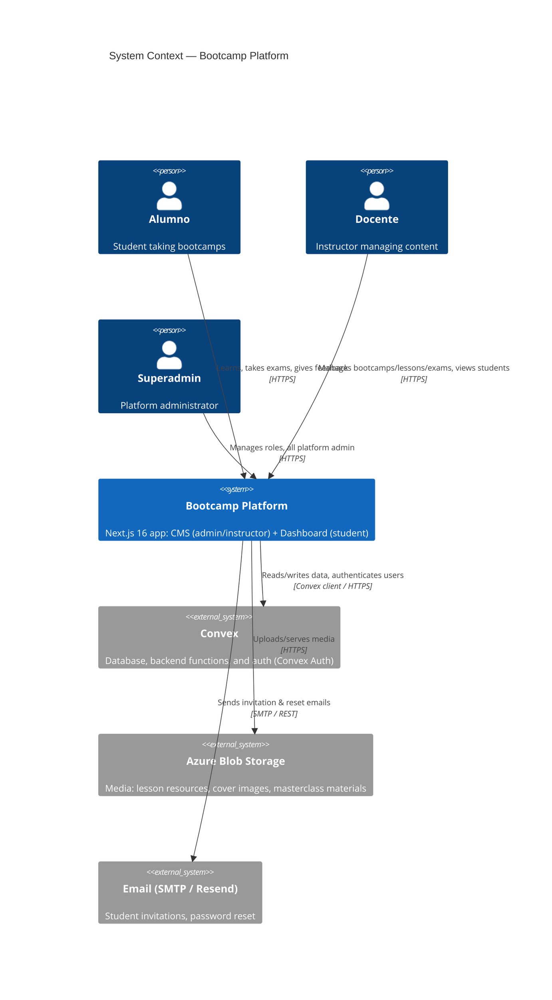

# C4 — Level 1: System Context

Shows Bootcamp Platform's position relative to its users and the external
services it depends on. See ADRs [[0002-supabase-to-convex-migration]] and
[[0006-azure-blob-for-media-storage]] for why these specific externals exist.

**Note:** Supabase does not appear here — it was fully replaced by Convex
(see [[0002-supabase-to-convex-migration]]). `supabase/migrations/*.sql` is
historical only.
