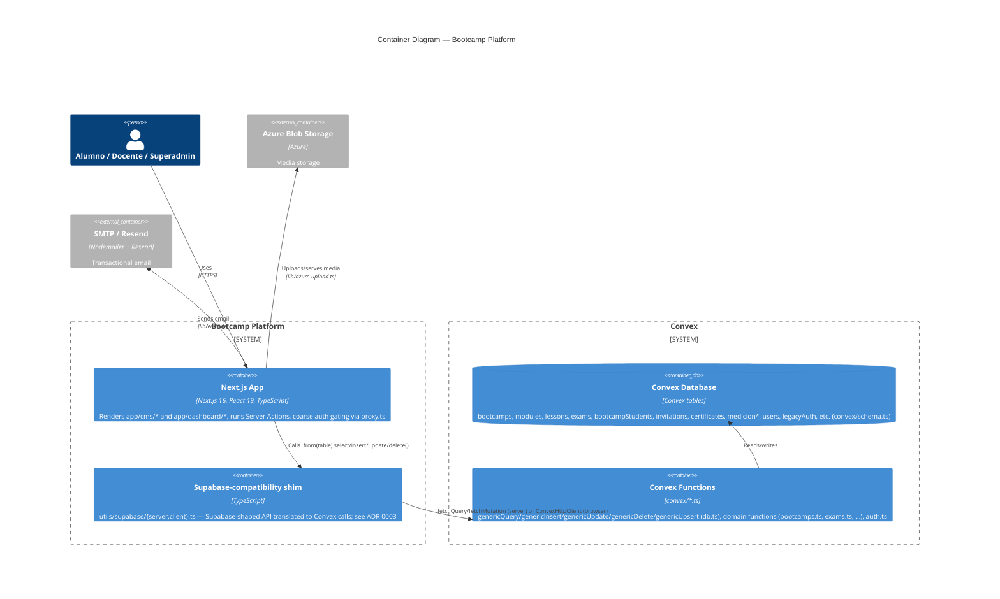

# C4 — Level 2: Containers

```mermaid
C4Container
    title Container Diagram — Bootcamp Platform

    Person(user, "Alumno / Docente / Superadmin")

    System_Boundary(platform, "Bootcamp Platform") {
        Container(nextapp, "Next.js App", "Next.js 16, React 19, TypeScript", "Renders app/cms/* and app/dashboard/*, runs Server Actions, coarse auth gating via proxy.ts")
        Container(shim, "Supabase-compatibility shim", "TypeScript", "utils/supabase/{server,client}.ts — Supabase-shaped API translated to Convex calls; see ADR 0003")
    }

    System_Boundary(convexSys, "Convex") {
        ContainerDb(convexDb, "Convex Database", "Convex tables", "bootcamps, modules, lessons, exams, bootcampStudents, invitations, certificates, medicion*, users, legacyAuth, etc. (convex/schema.ts)")
        Container(convexFns, "Convex Functions", "convex/*.ts", "genericQuery/genericInsert/genericUpdate/genericDelete/genericUpsert (db.ts), domain functions (bootcamps.ts, exams.ts, ...), auth.ts")
    }

    Container_Ext(azureBlob, "Azure Blob Storage", "Azure", "Media storage")
    Container_Ext(email, "SMTP / Resend", "Nodemailer + Resend", "Transactional email")

    Rel(user, nextapp, "Uses", "HTTPS")
    Rel(nextapp, shim, "Calls .from(table).select/insert/update/delete()")
    Rel(shim, convexFns, "fetchQuery/fetchMutation (server) or ConvexHttpClient (browser)")
    Rel(convexFns, convexDb, "Reads/writes")
    Rel(nextapp, azureBlob, "Uploads/serves media", "lib/azure-upload.ts")
    Rel(nextapp, email, "Sends email", "lib/email.ts")
```

Server Actions (`app/actions/*.ts`) run inside the Next.js App container and
are the only path to the shim (see [[0008-server-actions-for-mutations]]).
