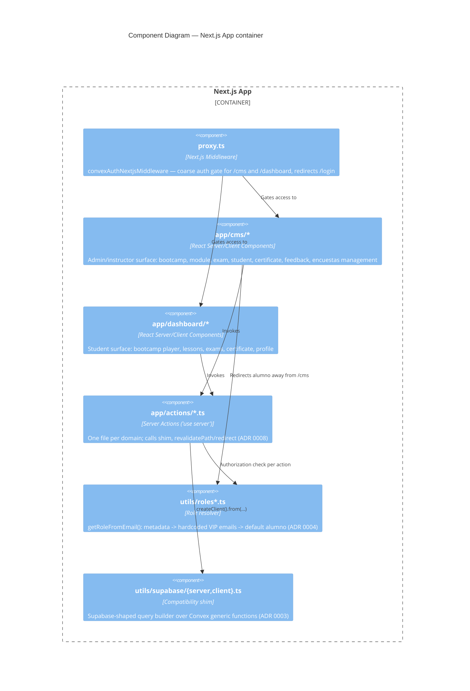

# C4 — Level 3: Components (inside the Next.js App container)

Both `app/cms/*` and `app/dashboard/*` independently re-check role via
`utils/roles*.ts` (see [[0001-nextjs-app-router-two-surfaces]] and
[[0004-convex-auth-and-role-model]]) — there is no single authorization
chokepoint in this diagram, by design.
